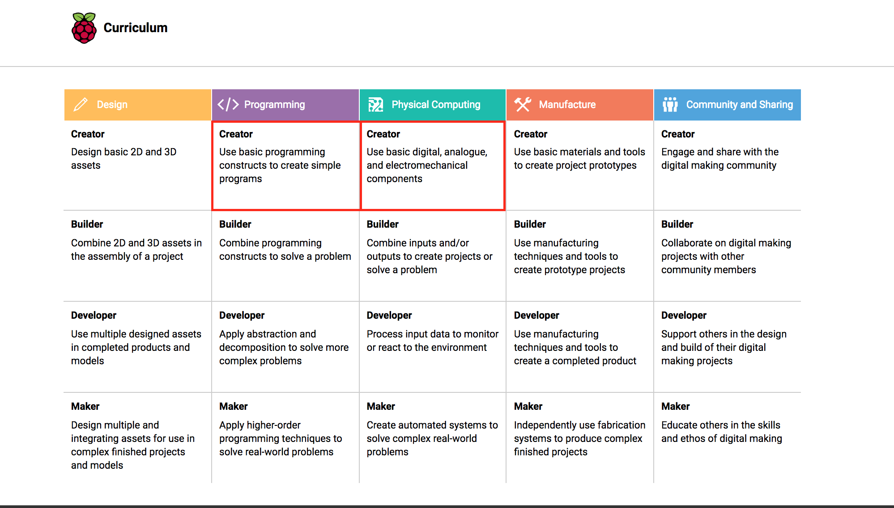

# Minecraft Hacking Raspberry Pi Basics

**HACK - MAKE - INVENT - SHARE**

 

*For English Version see here: [English](./english)*  

Stand 9. Juli 2017

---

Das sind die Kursmaterialien zum Minecraft Hacking Raspberry Pi Grundlagen Workshop vom #erfindergarden. Außerdem Tipps wie du zu Hause weitermachen kannst. 

* Im Ordner [docs](./docs) findest du eine Einkaufsliste und ein Getting Started Guide sowie nochmal alles was wir im Kurs besprochen haben
* Der Ordner [code](./code) enthält die Python und Scratch Programme aus dem Kurs
* Der Order [bonus_code](./bonus_code) findest du weitere Python Programme zum Minecraft Hacking

## Was wirst im Kurs machen

* Pong hacken
* Minecraft hacken
* ein TNT-Button mit Scratch Programmieren
* Terminal Quest
* einen TNT-Button mit Minecraft verbinden 
(* Musik coden)

## Was wirst du lernen 

* Was ein Raspberry Pi ist, warum man ihn braucht und wie man ihn zum laufen bringt
* Was ein Computerprogramm ist und die wichtigste Programmierkonstrukte 
* Wie man Minecraft mit Kano/Scratch hacken kann
* (Verstehe wie man Music Coded mit Sonic Pi)
* Inputs wie Buttons und Outputs wie LEDs mit Scratch steuern
* Linux Filestruktur
* Wichtige Command Line Befehle
* Dein erstes Python Programm zu schreiben
* Wo ich online gute Tutorials zum weiter machen finde

Dieser Workshop beinhaltet folgende Elemente des [Digital Making Curriculums](https://www.raspberrypi.org/curriculum/) der Raspberry Pi Foundation

* [Nutze Programmierkonstrukte um einfache Programme zu erstellen](https://www.raspberrypi.org/curriculum/programming/creator)
* [Nutze einfache digitale und analoge Input und Output Komponenten ](https://www.raspberrypi.org/curriculum/physical-computing/creator)

# Wie kann ich weitermachen?

Das wichtigste ist dass du Spaß hast und dir so schnell wie möglich einen Pi besorgst und mit einem kleinen eigenen Projekt anfängst. Am besten du kaufst schon einen Pi vor dem Kurs und kannst dann gleich zu Hause weiter machen. 

## Hardware und Software

Folgendes solltest du dir besorgen um zu Hause mit dem Pi weiterzuarbeiten. 

* einen Raspberry Pi am besten einen Pi3
* ein SD Karte mit einem Pi Betriebsystem (bekommst du im Kurs)
* einen Bildschirm
* ein HDMI Kabel
* eine Tastatur
* Eine Software zum SD Karten brennen wir [Etcher](https://etcher.io/)
* ein paar Elektronik Komponenten wir Buttons, LEDs, Widerstände
* ein Breadboard
* ein paar Steckbrücken

## Fortgeschrittenen Workshop

Wir kommen regelmäßig zurück nach Berlin, Wien, Hamburg und Frankfurt am Main für unseren Roboter Workshop

* Roboter Workshop (Folgeworkshop von Minecraft Hacking)

Die nächsten Termine findest du [hier] (https://www.erfindergarden.de/kurse-workshops/). 

## Pi Club

Wenn du in München wohnst und die der Grundlagen Kurs gefallen hast, kannst du immer Mittwoch von 18 bis 19.30 Uhr und Freitags von 17 bis 19 Uhr in den Pi Club kommen. Der Monatsbeitrag beträgt 25 € zzgl. MwSt.. und 50€ Aufnahmebeitrag. 

Anmeldungsformular hier. 

## Selbstständig weiter machen

### Online Hilfe 

Für die jenigen die nicht Mittwoch und Freitags in unseren Pi Club in München kommen können bieten wir an ihnen über Gitter zu helfen. Mache dir einfach einen Github Account und stelle deine Fragen in unserem Gitter Channel. 

### Mit dem Pi

Stecke die SD Karte aus dem Kurs in den Pi. 

Solltest du dieses Repository noch nicht geklont haben, öffne das Terminal und schreibe folgende Zeile und bestätige durch die Enter Taste

`git clone https://github.com/erfindergarden/minecraft-hacking.git`

Update den Code mit:

`sudo git pull`

resete deinen lokalen Veränderungen:

`sudo git reset --hard`

### Projekte für zu Hause

Als erstes kannst du dich noch weiter auf Kano umschauen und weiter machen mit:

In Make Minecraft protypen und dann den python code in den TNT Button Code pasten
Make an App
Make Art
Kano Code

Erste Anlaufstelle für weitere Projekte ist die [Raspberry Learning Resources ](https://www.raspberrypi.org/resources/learn/) und [Raspberry Making Resources](https://www.raspberrypi.org/resources/make/). Ein paar einfache Projekte zum Anfangen

* [Push Button Stop Motion](https://www.raspberrypi.org/learning/push-button-stop-motion/) 
* [Scratch Olympic Weightlifter](https://www.raspberrypi.org/learning/scratch-olympics-weightlifter/)

#### Ohne Raspberry Pi

Wenn du zunächst keinen Raspberry Pi kaufen möchtest kannst du trotzdem zu Hause weiter machen.

1. Programmiere online mit Scratch 2.0, die Programmiersprache die wir benutzt haben, um Pong und Minecraft zu hacken ([https://scratch.mit.edu/projects/editor/](https://scratch.mit.edu/projects/editor/))
	* du brauchst nur Firefox, Chrome und Flash
	* [hier kannst du Scratch Step-by-Step lernen ](https://scratch.mit.edu/projects/editor/?tip_bar=getStarted)
	* die Scratch Version die wir im Kurs verwendet haben ist [Scratch 1.4](https://scratch.mit.edu/scratch_1.4/) kannst du auch downloaden
	* du wirst viele Beispiele online finden
	* happy programming!

2. Du kannst auch Sonic Pi herunterladen, das Programm, mit dem wir Musik programmiert haben (Mac oder Windows, [http://sonic-pi.net/](http://sonic-pi.net/))
	* [hier findest du ein paar Beispiele ](http://sonic-pi.net/)
	* [und so programmiert man Daft Punk](https://aimxhaisse.com/aerodynamic-everything-en.html) 

3. Du kannst auch ein paar online Kurse durchmachen wie:

	* [Code.org](https://code.org/)
	* [Codeacademy.org](https://www.codecademy.com/)

#### Minecraft Pi API mit der Minecraft Vollversion

Dazu brauchst du das Raspberry Pi Juice Plugin auf deinem Server und die Libraries für Pyhton und Java 

   * [Rasperry Pi Juice Plugin](https://dev.bukkit.org/projects/raspberryjuice)
   * [Libraries](https://dev.bukkit.org/projects/raspberryjuice) 

## Kontakt

* Web: [www.erfindergarden.de](http://www.erfindergarden.de)
* Email: [play@erfindergarden.de](mailto:play@erfindergarden.de)
* Twitter: [@andreaskopp](https://twitter.com/andreaskopp) und [@jsphpl](https://twitter.com/jsphpl)

## Lizenz

Dieses Repository ist unter der Creative Commons Lizenz Attribution 4.0 Internatioal [CC-BY-SA 4.0] (http://creativecommons.org/licenses/by-sa/4.0/) lizensiert. Das heißt du kannst unser Material benutzen und verändern solltest aber wenn du es nutzt schreiben, dass du es von uns hast und wieder dein Material mit CC-BY-SA lizensieren.

