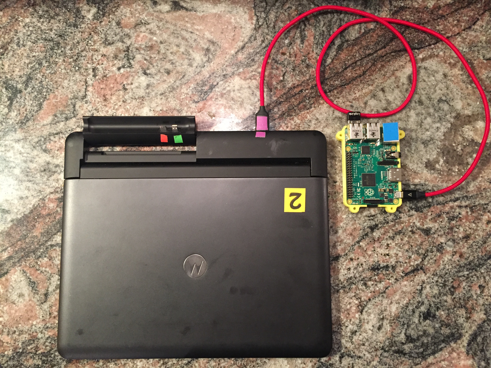
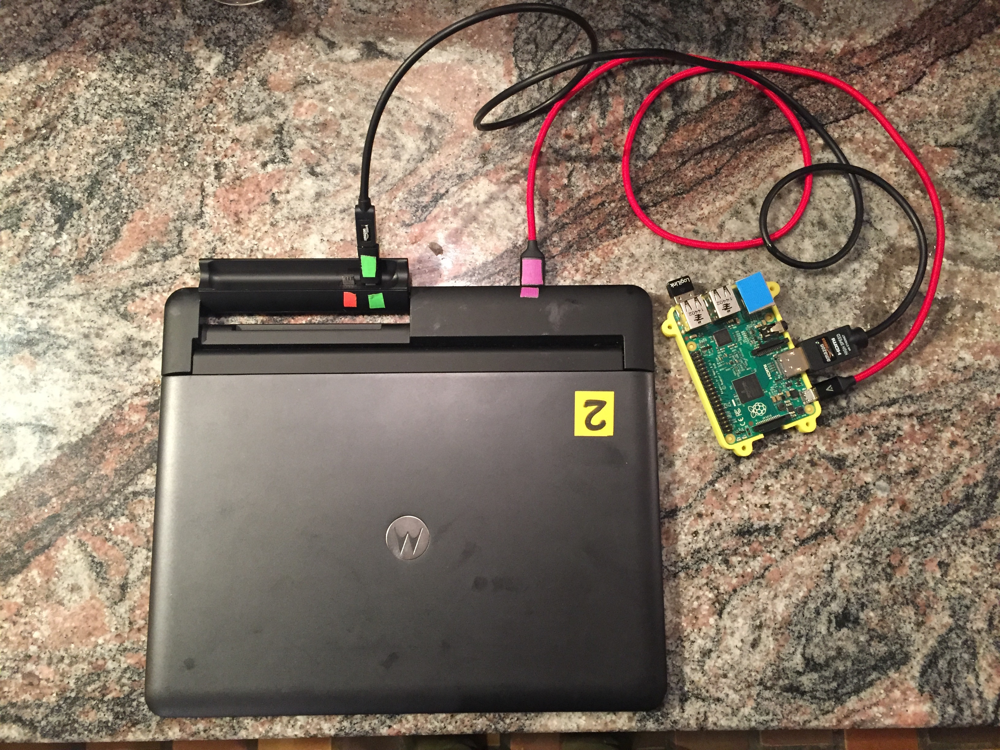
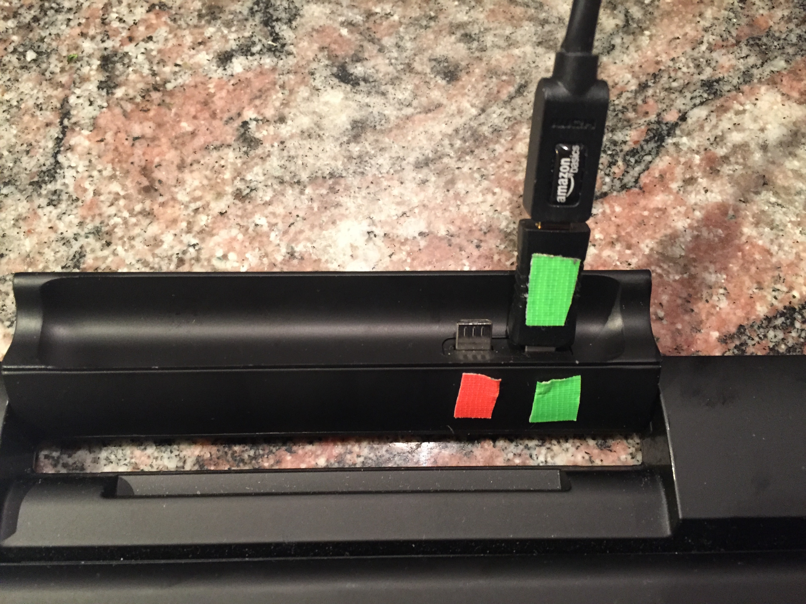
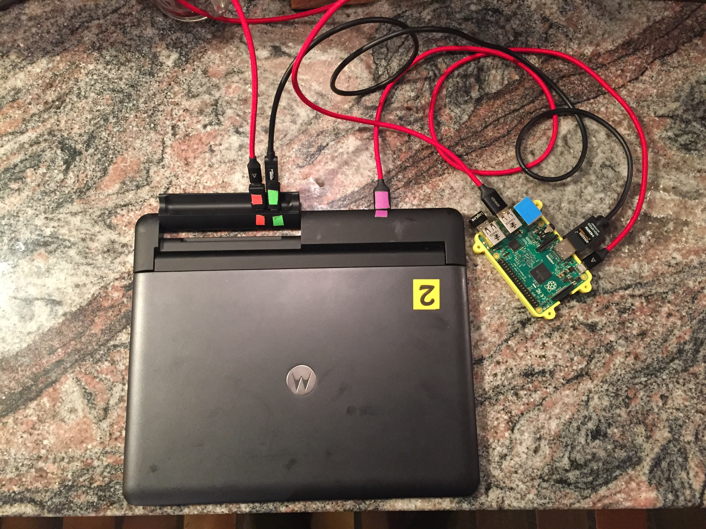
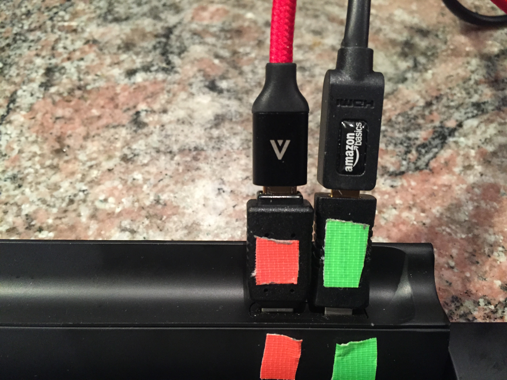
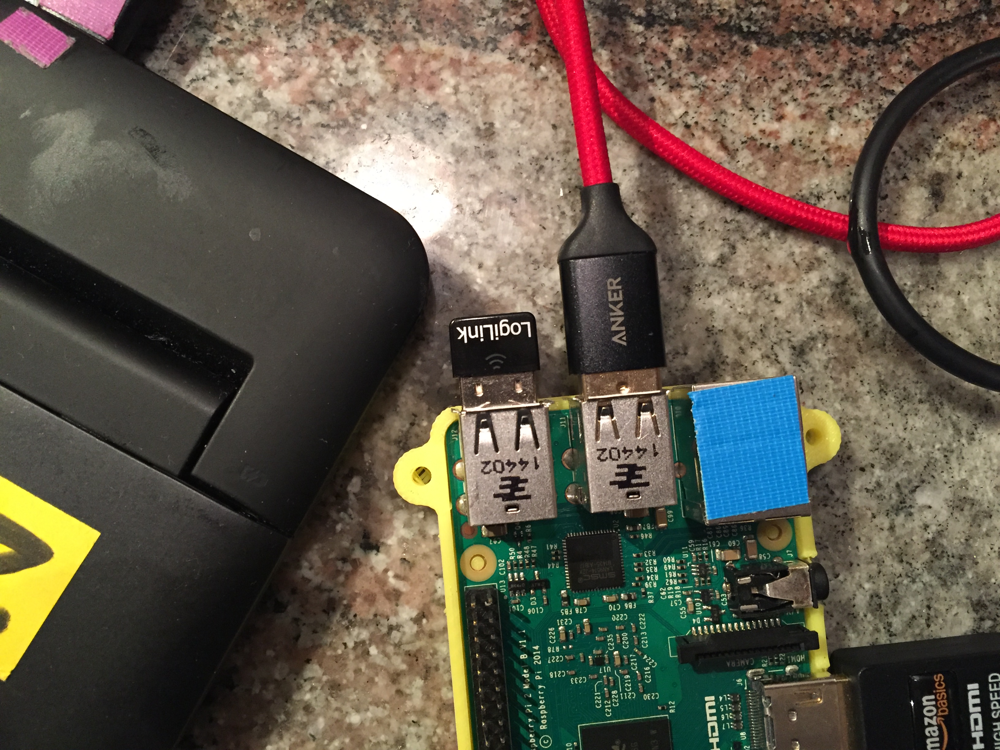
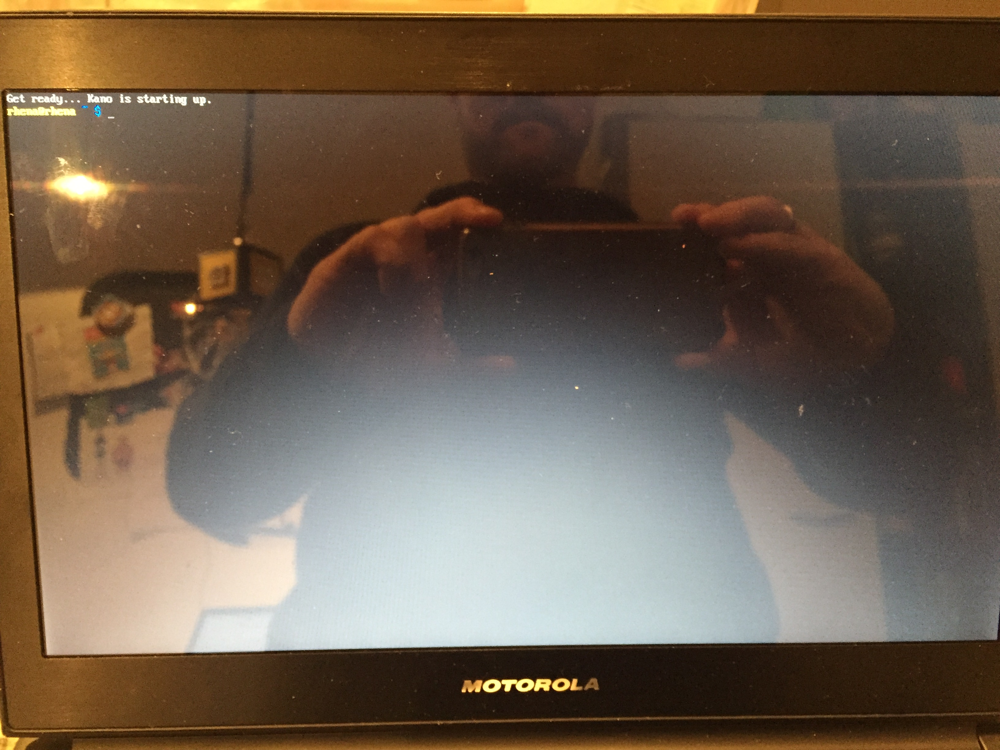

## Lapdock mit dem Pi verbinden

1. Schaue dir meine Einkaufsliste an und kaufe was du brauchst
2. Nehme eins der beiden Mirco USB zu USB Kabel und stecke das Mirco USB in den Pi und das USB in den zugeklappten Lapdock.

3. Verbinde das HDMI Kabel mit dem HDMI Adapter und stecke das eine Ende in den rechten Port des Lapdock und das andere Ende in den HDMI Port des Pis

4. Verbinde das zweite Mirco USB Kabel mit dem USB Adapter und Stecke es in den Linken Port des Lapdocks

5. Check ob die Kabel fest drin stecken und klappe dann den Lapdock auf. Das rote LED am Pi sollte angeben und das grüne blinken, außerdem sollte etwas am Bildschirm zu sehen sein.

6. Solltest du nichts auf dem Bildschirm sehen überprüfe folgendes:
	* sind alle Kabel richtig angeschlossen, überprüfe jedes Kabel einzelnd
	* stecken die Kabel fest im Pi und im Lapdock
	* Hat mein Lapdock genügend Power, drücke den kleinen Knopf unter dem Trackpad, um zu sehen wieviel Power der Akku noch hat und schließe den Lapdock an den Strom an
	* Klappe den Lapdock zu und wieder auf
manchmal kann es sein dass du ein schlechtes USB Kabel hast, wenn es nicht klappt verwenden ein anderes USB Kabel  

7. Solltest du eine Fehlermeldung auf dem Bildschirm sehen oder sollte der Pi immer wieder booten, kann die SD Karte kaputt sein. Brenne eine zweite SD Karte und probiere es mit ihr aus.