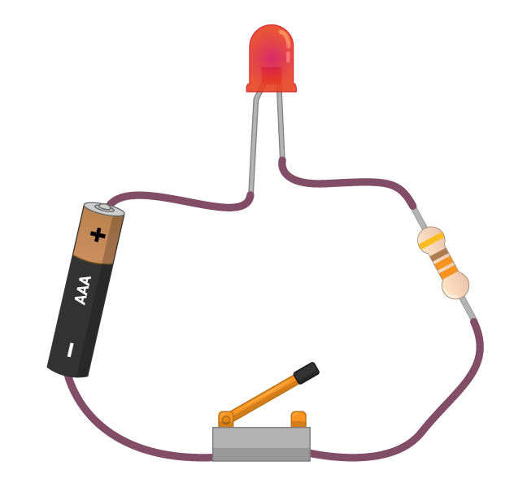
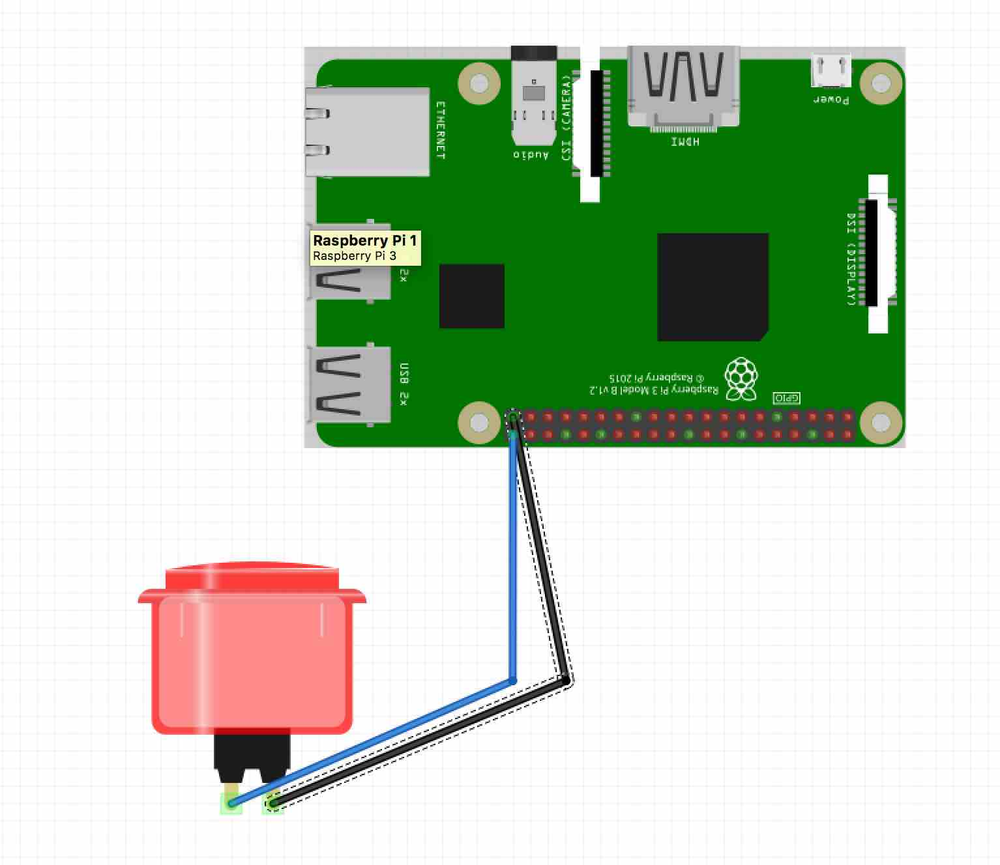
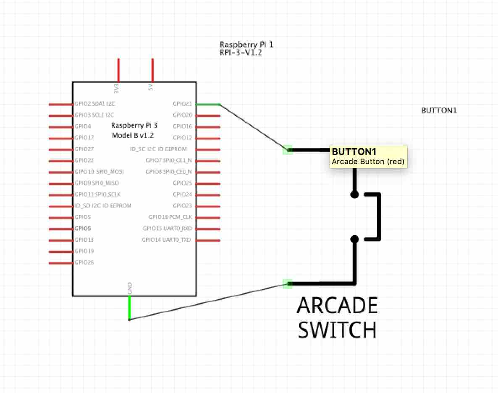
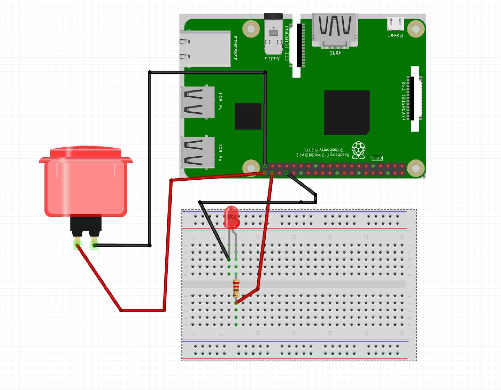
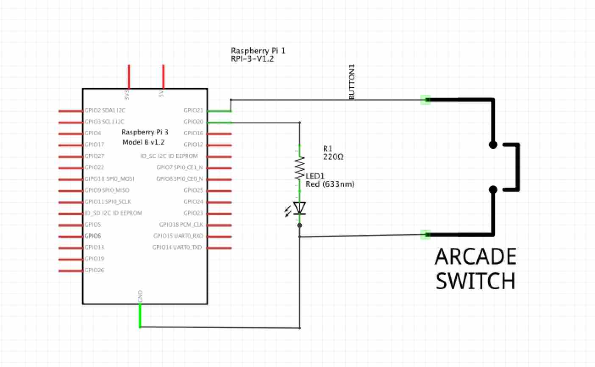

# Minecraft Hacking Raspberry Pi Grundlagen   


Stand 14. April 2017


---

##Kursinhalt

###SD Karte brennen

Es kann passieren, dass deine Karte plötzlich nicht mehr funktioniert, mit folgenden Schritten kannst du dir eine neue machen:

* besorge dir eine neue SD Karte (mind. 8GB Class 10)
* Downloade das [Kano Image](http://www2.kano.me/downloads) oder ein anderes Raspberry Pi OS Image wie [Raspian Jesse](https://www.raspberrypi.org/downloads/raspbian/) 
* Hole dir das Programm [Etcher](https://etcher.io/)


### Lapdock mit dem Pi verbinden

Schaue dir die [Anleitung](./lapdockpi) an. 

### Coole Projekte

* [Magig Mirror](http://michaelteeuw.nl/post/84026273526/and-there-it-is-the-end-result-of-the-magic)
* [Retropi](retropie.org.uk)

### Pi Einführung

* Arduino vs. Raspberry Pi vs. Microbit/Calliope
* Hardware Pi 3


### Pong Hacking

Zu Hause kannst zu Hause nochmal im Browser Pong hacken. 

[pong.kano.me](http://pong.kano.me/#)

Oder du kannst auch weiter machen mit Pong Hacken und auch gleich Javascript lernen. 

[www.codecademy.com/courses/kano-pong](https://www.codecademy.com/courses/kano-pong)

### Minecraft Hacking 

Folgende Aufgaben hast du im Kurs gemacht:

* Minecraft - Challenge 1: Load up Minecraft
* Minecraft - Challenge 2: Hello World
* Minecraft - Challenge 3: Teleport
* Minecraft - Challenge 4: Make a Lake
* Minecraft - Challenge 5: Build a Mega Block
* Minecraft - Challenge 6: All Along the Watchtower
* Minecraft - Challenge 7: Shady Tunnels
* Minecraft - Challenge 8: Volcano
* Minecraft - Challenge 9: Build a Tall Tower
* Minecraft - Challenge 10: Stairway to Heaven
* Minecraft - Challenge 11: Castle Wall
* Minecraft - Challenge 12: Lava Trail
* Minecraft - Challenge 13: Freeze

Solltest du noch nicht fertig geworden sein kannst du zu Hause die Aufgaben fertig machen. Im Playground kannst du dann deine eigenen Programme schreiben und dir auch anzeigen lassen wie der Code in Python aussehen würde. 

### Musik Coden

Im Workshop hast du gelernt Töne zu programmieren und man Töne endlos abspielen lassen kann. Sollten wir Sonic Pi nicht behandelt haben kannst du Sonic Pi einfach zu Hause ausprobieren. 

Schreibe ein eigenes Musikstück mit Code. Solltest du noch keinen Pi haben kannst du auch Sonic Pi auf dem Mac oder deinem Windows Computer programmieren. 

[http://sonic-pi.net/](http://sonic-pi.net/)

### Scratch 

Im Kurs haben wir zunächst Scratch gelernt und einen Controller programmiert und dann unser Sprite explodieren lassen. Den Code dazu findest du unter [code](../code). 


### GPIOS (General Input Output, Allzweg Ein- und Ausgabe)

Alle aktuellen Raspberry Pi Versionen haben 40 Pins. Davon sind 8 Ground Pins also Erde oder 0V, 2 sind 5V und 2 sind 3V3 sowie 26 davon sind Input und Output pins und zwei sind spezielle EEPROM pins. Eine genauere Beschreibung jedes einzelnen Pins findest du bei [pinout.xyz](https://pinout.xyz/pinout). Wir nutzen in unserem Workshops immer die GPIO Nummmerierung und nicht Physical Nummerierung.  


Physical Nummerierung


GPIO Nummerierung


Sie dienen dazu Inputs wie Buttons, Sensoren und Outputs wie LEDS und Motoren mit dem Pi zu verbinden.  

Einen einfacher Schaltkreis wäre etwa ein LED an einer 3.3V Batterie und einem Schalter dazwischen. 




Wenn wir einen GPIO Pin als Output nutzen ersetzt der Pi sowohl den Schalter als auch die 3.3V Batterie. Den Schalter machen wir dann mit unserem Code. Damit die LED nicht die vollen 3.3V abbekommt nutzen wir einen Widerstand. 

Den Widerstand kannst du folgendermaßen ausrechnen.
Ersmal musst du Wissen welche LED du anschließt. Nehmen wir mal an wir verbinden eine rote LED. 

Strom PI (I): 3.3V
Strom LED (I): 2.0V
Spannung LED (U): 20mA  

R = U/I = Strom/ Spannung =  3.3V - 2.0 V/20 mA = 68 Ohm


[Widerstandsrechner](http://led.linear1.org/1led.wiz)


Laut Ohmschen gesetzt würde ein 68 Ohm Widerstand. 

In dem Fall ist uns aber unser GPIO Pin wichtiger und der verträgt aximal 16mA und wird idealerweise zwischen 3 und 8mA betrieben wird. Insgesamt sollten an allen Pins nicht mehr als 

Strom PI (I): 3.3V
Strom LED (I): 2.0V
Spannung Pin (U): 3 bis 8 mA


R = U/I = Strom/ Spannung =  3.3V - 2.0 V/ U = 220 bis 470 Ohm

Daraus resultiert also ein Widerstand zwischen 220 und 470 Ohm. 


###GPIOS + Scratch

Als erstes haben wir im Kurs gezeigt wie man einen Button an den Pi anschließt. Wir nutzen immer die letzten beiden Pins. 

#### Scratch + Button 


  
  
 
 
 Scratch Code einfügen
 
 
 
#### Scratch + LED
 

 
 
 
 Scratch Code einfügen 
 

#### Scratch + Button + LED


  

#### TNT Button/Circle 

Am Endes des Kurses habe ich dir noch kurz gezeigt wir mit dem Drücken eines Buttons einen TNT Button und einen Circle erstellt. 

Den Code dazu findest du unter [Code](./code) 

Öffne das Terminal und tippe. 

```
sudo geany 

```

Das passwort ist kano. 

Dann öffnet sich der Editor. Mit dem kleinen Rädchen kannst du den Code ausführen und mit ```Ctrl + C``` kannst du in stoppen.

Wichtig ist, dass du deinen Code immer unter dem Ordner Code abspeicherst mit der Endung .py und Minecraft offen hast, wenn du den Code ausführst. 

Mehr Code findest du [hier](http://eu.wiley.com/WileyCDA/Section/id-823690.html).


## More Minecraft Worlds

Die Pi Minecraft Edition nutzt das gleiche Level Format wie die Minecraft Pocket Edition [here](https://drive.google.com/open?id=0B3iYmii-HJ7TeE5MS3BqM2hwaFE) kannst du mehr Welten finden wie Hogwarts, Avatar Hometree, Circular Town, Farm Village, Spleef Arena und mehr. Weitere Welten im [Minecraft Forum](http://www.minecraftforum.net/forums/minecraft-pocket-edition/mcpe-maps/mcpe-wip-maps).

Lade die Welten herunter und kopiere sie in den Ordner ```minecraftWorlds```. Um diesen Ordner zu sehen musst du erst versteckete Dateien (Show Hidden) anzeigen dann findest du ihn under .minecraft > games > com.mojang > minecraftWorlds. 

## Spiele deine programmierte Welt auf den i-phone/i-pad

Du kannst deine mit dem Pi programmierten Welten dann in deiner Pocket Edition auf dein i-pad oder i-phone kopieren. In [diesem Video](https://www.youtube.com/watch?v=muB7SDl6158) wird die gezeigt wie das geht. Für Mac empfehle ich dir den i-explorer. 


## Links, Magazine und Bücher

Es gibt mittlerweile viele Zeitschriften, Bücher und Internetseiten die die helfen weiter mit dem Pi zu arbeiten. Ich empfehle dir erstmal, mit dem weiterzuarbeiten was wir im Kurs gemacht haben und dann auf der Raspberry Pi Seite eine Tutorial durch zu machen. Sehr gut finde ich auch das MagPi Magazin. Mittlweile gibt es das Magazin sogar auf Deutsch. 

* [Ressources in Englisch auf der Raspberry Pi Webseite] (https://www.raspberrypi.org/resources/)
* Projekte die ich empfehlen kann: 
	* 

* [das MagPi Magazin](https://www.chip-kiosk.de/chip/magpi)


## Einkaufsliste

Alles was du brauchst um nach dem Kurs weiterzumachen findest du in der [Einkaufsliste](./einkaufsliste.md).

## Wo Zubehör kaufen?

Aufsteckboards und Zubehör wie Breadboards, Leds, Buttons und Motoren kannst du bei folgenden Händlern erwerben. 

* Conrad (DE)
* [Reichelt (DE)](https://www.reichelt.de/)
* [Watterott (DE)](http://www.watterott.com/)
* Amazon  
* [exptech (DE)](http://www.exp-tech.de/)
* [Ryanteck (GB)](https://ryanteck.uk/) 
* [Pi Hut (GB)](http://thepihut.com/)
* [Pimoroni (GB)](http://www.pimoroni.com/)

##FAQ

**Wie schließe ich meinen Lapdock an?**

Siehe oben

**Wie wird der Pi mit Strom versorgt?**

Der Pi wird über das USB Kabel im Lapdock mit Strom versorgt. 

**Ich sehe nichts auf meinem Bildschirm?**

Checke ob du die SD Karte eingesteckt hast und alle Kabel verbunden hast und ob sie fest in ihren Plätzen stecken. 


**Was ist das Password beim einloggen in Kano**

kano 

**Die Zeichen auf den Tasten stimmen nicht mit meinem Keyboard Layout überein, was kann ich machen?**

Unter Settings in kano kannst du deine Tastaturbelegungen auf Deutsch ändern. 

Und mit einem [Tastatursticker ](http://www.amazon.de/Selbstkleben-Deutsche-Tastatur-Aufkleber-TastaturAufkleber/dp/B0050O4K5C/ref=pd_sim_sbs_201_4?ie=UTF8&dpID=31ijYeQClxL&dpSrc=sims&preST=_AC_UL160_SR160%2C160_&refRID=1J1A4ZD3M4SX3HV9JPDT)kannst du dir eine Deutsche Tastatur auf die Tasten kleben.


## Kontakt

Schreibe uns jeder Zeit eine e-mail wenn du Fragen hast die in diesem Repository nicht beantwortet wurden.

* Web: [www.erfindergarden.de](http://www.erfindergarden.de)
* Email: [play@erfindergarden.de](mailto:play@erfindergarden.de)
* Twitter: [@andreaskopp](https://twitter.com/andreaskopp) und [@jsphpl](https://twitter.com/jsphpl)


## Lizenz
Dieses Repository ist unter der Creative Commons Lizenz [CC-BY-SA 4.0] (http://creativecommons.org/licenses/by-sa/4.0/) lizensiert. 


