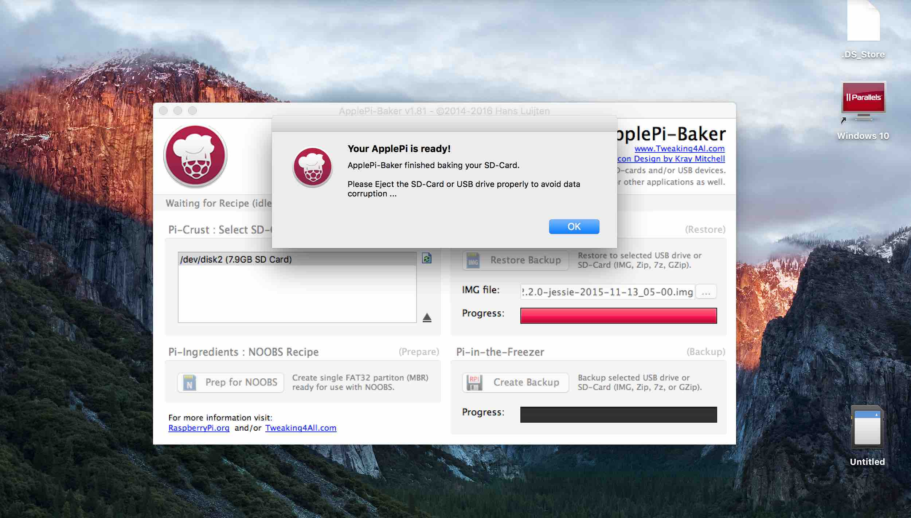

# Image auf die SD Karte brennen - Mac

### 1. [Apple Pi Baker ](http://www.tweaking4all.com/hardware/raspberry-pi/macosx-apple-pi-baker/)herunterladen
### 2. SD Karte einlegen (mind 8GB Class 10 Karte)
### 3. Admin Passwort eingeben

### 4. SD Karte reloaden, damit Karte angezeigt wird

### 5. Kano Image Downloaden unter [Download the image directly](http://www2.kano.me/downloads)

### 6. Ort suchen wo du es abgespeichert hast. Auf Restore Backup klicken. 

### 6. Eject SD Karte

### 7. Mini SD Karte aus Hülle holen und in Pi einstecken